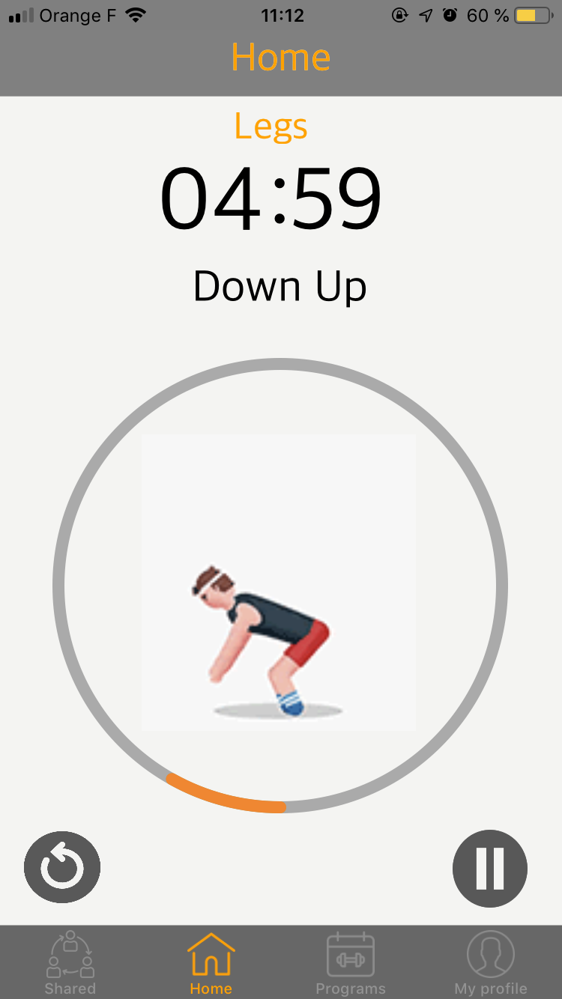

# SportWithYou!
> This project is a sport application to motivate people to do sport no matter how long they have. This project was a school project. We had 3 weeks to finish him.

[](https://swift.org/)
![Xcode 10.2][xcode-image]

SportWithYou is a mobile application that allows users to play sports by creating their own sports programs, they can also enter the time during which they are available to play sports, then the application will offer them programs according to the time entered and according to their levels that was previously entered during registration. Users will also be able to create their own programs and share them with other users via the Community tab. The users will also be able to follow their evolutions (followed by the weight, ...), the users will also have success according to the performances which they provided in their profile.




## Installation

Only avaible on MacOS. This app was developped with swift 4.2 and xcode 10.2<br> 
First, install pod in the directory where you have download this project.
```sh
cd (directory where you have download this project)
ls -l // Make sur that the podfile is here
pod install
```
Next, launch the .xcworkspace


## Usage example

At home, after work, the week-end etc ...
<br>
## Development setup

If you want to install other pods for update this app, open podfile, add your pod that you want to insall and write
```sh
pod install
```

## Release History

* 1.0
    * First version of SportWithYou
    * The website is hosted here: https://sportwithyou-ynov.firebaseapp.com

## Meta

Dany JEAN-CHARLES – [@Weder_77](https://twitter.com/Weder_77) – dany.jeancharles@ynov.com


## Contributing

1. Fork it (<https://github.com/Weder77/SportWithYou->)
2. Create your feature branch (`git checkout -b feature/fooBar`)
3. Commit your changes (`git commit -am 'Add some fooBar'`)
4. Push to the branch (`git push origin feature/fooBar`)
5. Create a new Pull Request

<!-- Markdown link & img dfn's -->
[swift-image]: https://img.shields.io/apm/v/swift.svg?color=swift&label=swift&logo=swift&logoColor=swift
[xcode-image]: https://img.shields.io/badge/xcode-10.2-blue.svg
[npm-url]: https://npmjs.org/package/datadog-metrics
[npm-downloads]: https://img.shields.io/npm/dm/datadog-metrics.svg?style=flat-square
[travis-image]: https://img.shields.io/travis/dbader/node-datadog-metrics/master.svg?style=flat-square
[travis-url]: https://travis-ci.org/dbader/node-datadog-metrics
[wiki]: https://github.com/yourname/yourproject/wiki
